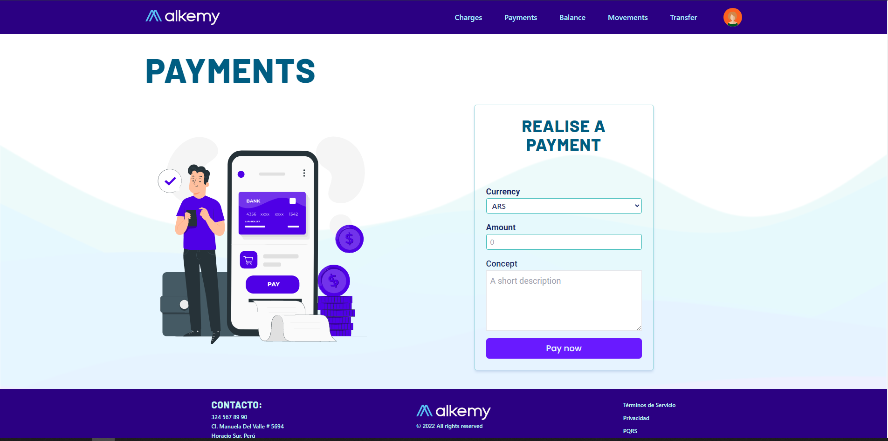

# Aplicacion AlkyBank

## Pasos para intalacion

### 1) `git clone https://github.com/JeanVittory/AlkyBank`

Clonar el repositorio en su local.

### 2) `npm i`

Una vez con el repositorio clonado ingresar a la carpeta 'alkemy-alkybank' y utilizar el comando
para instalar las dependencias.

### 3) `npm start`

Al finalizar la instalacion de dependencias lanzar el comando 'npm start' para correr la aplicacion
en un servidor local.

### 4) `Creación de variables`

Para testear con un rol de administrador, utilices la cuenta que utilices
REACT_APP_ADMIN_EMAIL=my_admin@example.com
REACT_APP_ADMIN_PASSWORD=123456aA

